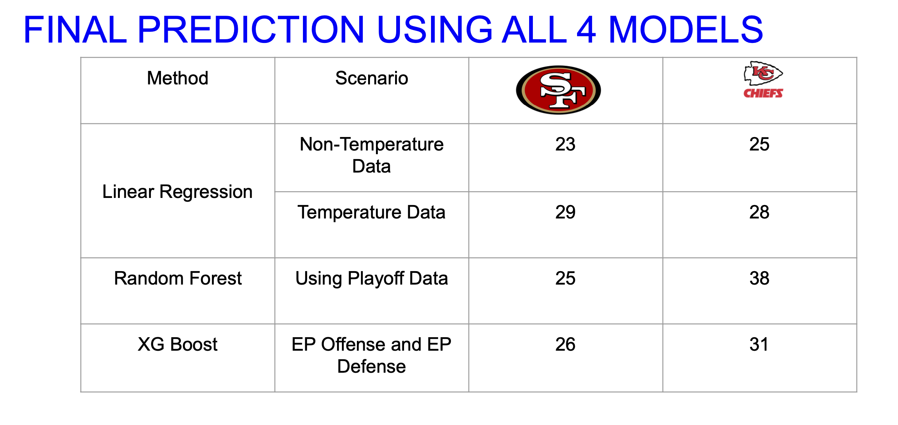

# Super Bowl 54 Score Prediction Using Machine Learning

### Models Used: Linear Regression, Random Forest, XGBoost
### Linear Regression Prediction: 25-23 Chiefs Win
### Linear Regression with Weather Data Included: 29-28 49ers Win
### Random Forest Prediction: 38-25 Chiefs Win
### XGBoost Model Prediction: 31-26 Chiefs Win
### Ensemble Model Composite Prediction: 28-26 Chiefs Win  
### ACTUAL FINAL SCORE
### Kansas City Chiefs - 31 
### San Francisco 49ers - 20

### Ultimately, the models can be scored by calculating the distance between the predicted score value minus the actual final score value. XGBoost is #1 followed by linear regression. 
* Linear Regression was off by 9 points
* The Linear Regression with Weather was off by 12 points
* THe Random Forest was off by 12 points
* XGBoost 6 points

### This project underscored the importance of deep contextual understanding (domain knowledge), the ability to wrangle data in Python to process datasets for insights, and knowledge of how to apply multiple machine learning models to a unique problem space. 
